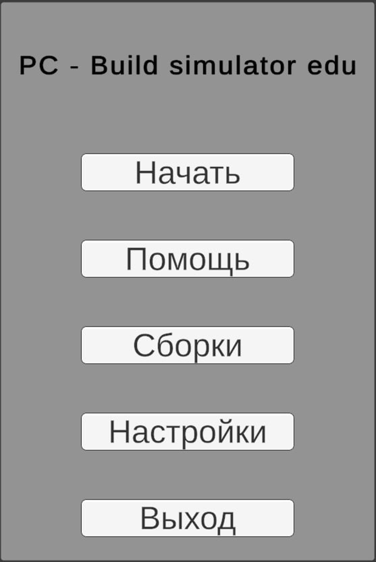
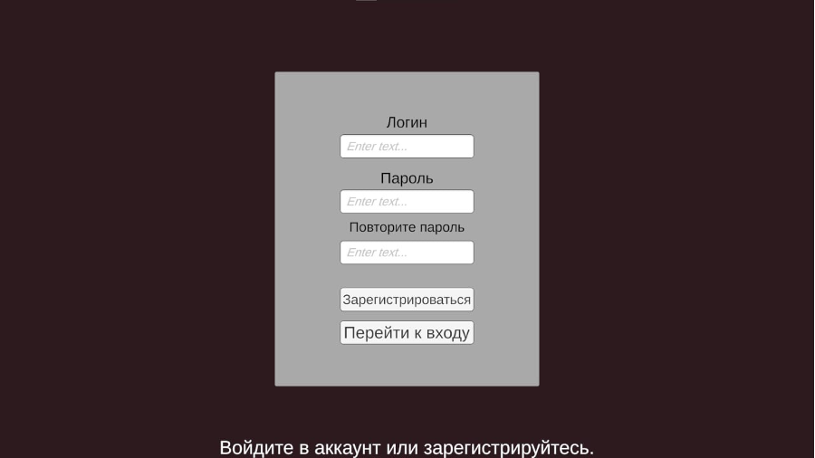
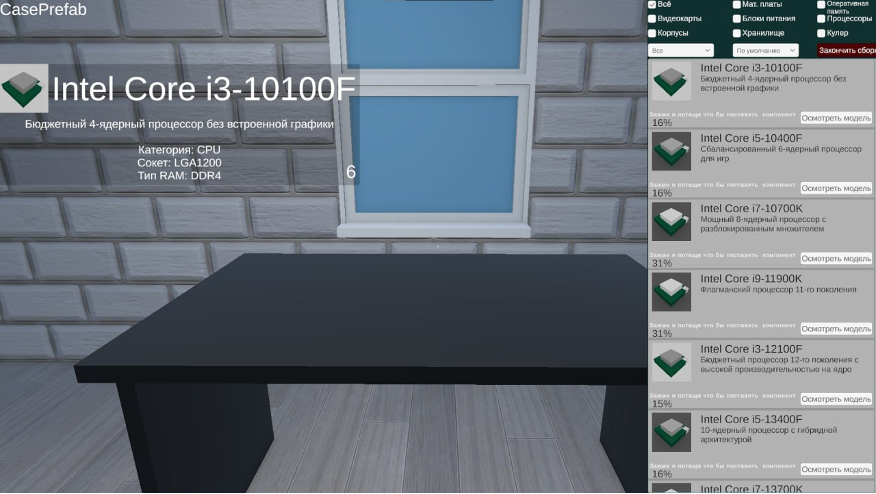
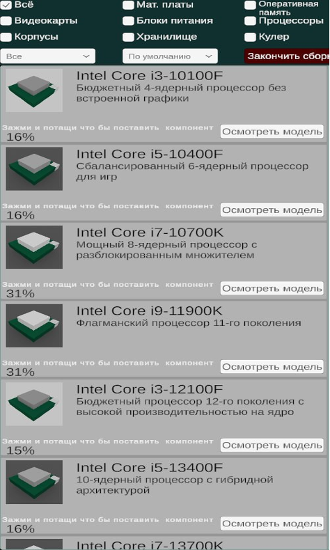
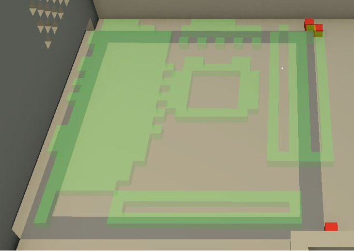
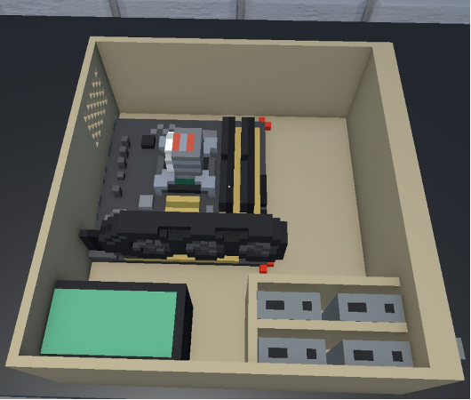
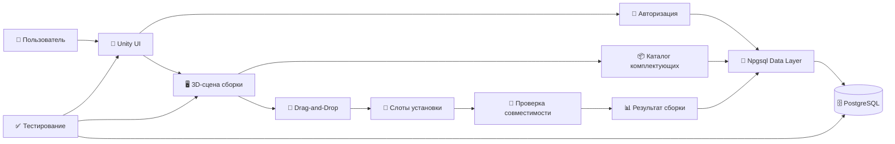
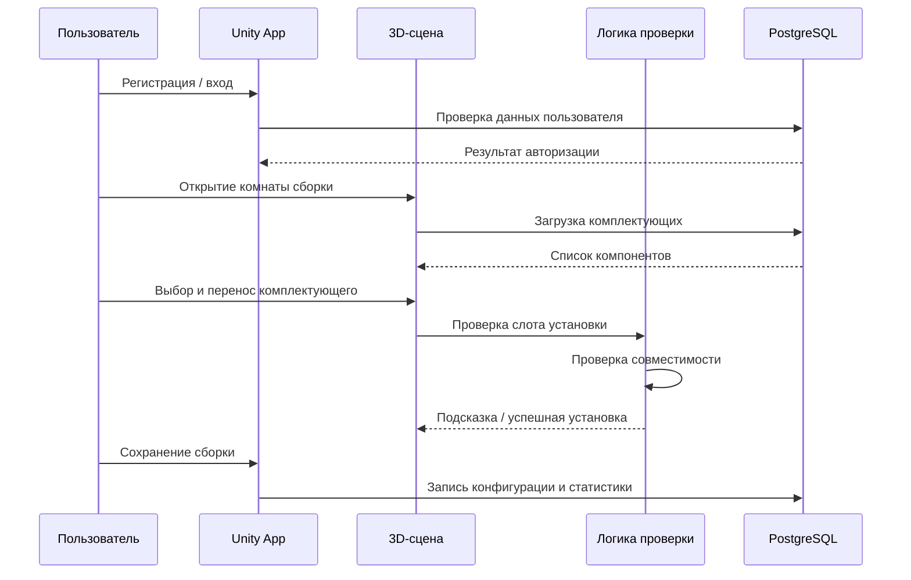
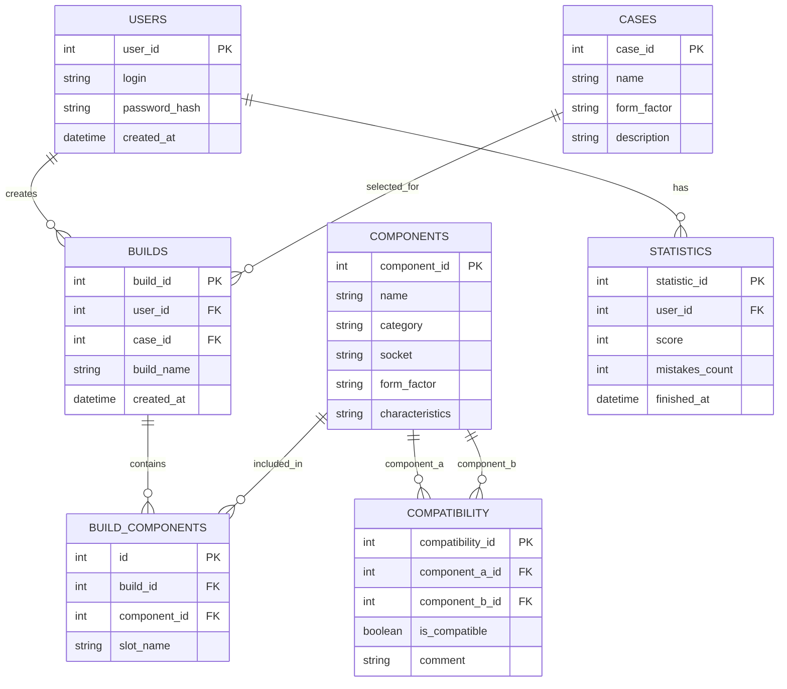

# 🖥️ PC Assembly Simulator

### Обучающий Unity-симулятор для изучения комплектующих компьютера и виртуальной сборки ПК

  
  
  
  
  

  
  
  

  <a href="#-about-the-project">About</a> •
  <a href="#-features">Features</a> •
  <a href="#-architecture">Architecture</a> •
  <a href="#-database">Database</a> •
  <a href="#-testing">Testing</a> •
  <a href="#-quick-start">Quick Start</a>

---

## 📌

**PC Assembly Simulator** — это интерактивное обучающее приложение, разработанное на **Unity** для демонстрации процесса сборки персонального компьютера в виртуальной 3D-среде.

Проект предназначен для студентов, школьников и начинающих пользователей, которым необходимо изучить устройство системного блока, назначение комплектующих и правила их совместной установки. Вместо изучения сборки только по текстам или видеороликам пользователь работает с виртуальными моделями, выбирает компоненты, размещает их в корпусе и получает обратную связь от системы.

Приложение помогает изучать:

- основные комплектующие персонального компьютера;
- назначение процессора, материнской платы, видеокарты, оперативной памяти, блока питания и накопителей;
- порядок установки компонентов в корпус;
- базовые правила совместимости оборудования;
- сохранение пользовательских сборок и результатов обучения.

---

## 🎯 Цели

Цель проекта — разработать обучающий симулятор сборки персонального компьютера, позволяющий пользователю изучать комплектующие ПК, проверять их совместимость и выполнять виртуальную сборку компьютера в интерактивном режиме.

Основные задачи проекта:

| № | Задача |
|---|---|
| 1 | Разработать пользовательский интерфейс приложения |
| 2 | Реализовать регистрацию и авторизацию пользователей |
| 3 | Создать интерактивную 3D-сцену сборки компьютера |
| 4 | Реализовать механизм перемещения комплектующих Drag-and-Drop |
| 5 | Добавить проверку правильности установки компонентов |
| 6 | Реализовать проверку совместимости комплектующих |
| 7 | Настроить хранение данных в PostgreSQL |
| 8 | Реализовать сохранение и загрузку пользовательских сборок |
| 9 | Провести тестирование основных функций приложения |

---

## 🧩 Особенности

| Модуль | Возможность |
|---|---|
| 🔐 User Account | Регистрация, авторизация и работа с учётной записью пользователя |
| 🖥️ 3D Assembly Room | Интерактивная сцена для виртуальной сборки системного блока |
| 🧲 Drag-and-Drop | Перемещение комплектующих и установка в подходящие слоты |
| 🧠 Compatibility Check | Проверка совместимости компонентов ПК |
| 💡 Hint System | Подсказки при выборе или неправильной установке комплектующих |
| 📦 Component Catalog | Список комплектующих с характеристиками и фильтрацией |
| 💾 Save / Load Builds | Сохранение и загрузка созданных конфигураций компьютера |
| 📊 Learning Results | Формирование результата прохождения обучающего сценария |
| 🗄️ PostgreSQL Storage | Хранение пользователей, комплектующих, сборок и статистики |

---

## 🖼 Скриншоты

| Главное меню | Регистрация / вход |
|---|---|
|  |  |

| Комната сборки | Каталог комплектующих |
|---|---|
|  |  |

| Установка комплектующей | Финальный собранный ПК |
|---|---|
|  |  |

Минимальный набор скриншотов закрывает основные пользовательские сценарии: запуск приложения, вход в систему, выбор комплектующих, процесс сборки и итоговый результат.

---

## 🏗 Архитектура

Приложение построено как Unity-клиент с локальным взаимодействием с базой данных PostgreSQL через библиотеку **Npgsql**.

### Слои

| Уровень | Технологии | Назначение |
|---|---|---|
| Client | Unity, C# | Интерфейс, 3D-сцена, логика сборки, взаимодействие пользователя с объектами |
| Data Access | Npgsql | Подключение Unity-приложения к PostgreSQL |
| Database | PostgreSQL | Хранение пользователей, комплектующих, сборок, совместимости и статистики |
| Assets | 3D-модели, Unity UI | Визуальное представление компонентов и интерфейса |
| Testing | Ручное и функциональное тестирование | Проверка корректности основных сценариев работы |

---

## 🔄 Application Flow

---

## 🗄 БД

База данных используется для хранения информации о пользователях, комплектующих, совместимости компонентов и результатах прохождения обучающих сценариев.

### Database Tables

| Таблица | Назначение |
|---|---|
| `users` | Данные зарегистрированных пользователей |
| `components` | Сведения о комплектующих персонального компьютера |
| `cases` | Информация о корпусах ПК |
| `compatibility` | Правила совместимости комплектующих |
| `builds` | Сохранённые пользовательские сборки |
| `build_components` | Состав конкретной сборки |
| `statistics` | Результаты прохождения обучающих сценариев |

---

## 🧪 Тесты

Тестирование проекта направлено на проверку корректности пользовательских сценариев, стабильности интерфейса, работы Drag-and-Drop и сохранения данных.

| Test Case | What is checked | Expected Result |
|---|---|---|
| Registration Test | Регистрация нового пользователя | Пользователь успешно создаётся в системе |
| Authorization Test | Вход по корректным данным | Пользователь попадает в главное меню |
| Wrong Login Test | Обработка неправильных данных | Система выводит сообщение об ошибке |
| Scene Loading Test | Загрузка комнаты сборки | 3D-сцена открывается без ошибок |
| Drag-and-Drop Test | Перемещение комплектующих | Компонент корректно перемещается пользователем |
| Installation Test | Установка детали в подходящий слот | Компонент фиксируется в нужной области |
| Wrong Slot Test | Попытка неправильной установки | Система запрещает установку и показывает подсказку |
| Compatibility Test | Проверка совместимости компонентов | Несовместимые детали не проходят проверку |
| Save Build Test | Сохранение конфигурации ПК | Сборка записывается в базу данных |
| Load Build Test | Загрузка ранее сохранённой сборки | Конфигурация восстанавливается в приложении |
| Result Test | Формирование результата обучения | Отображается оценка действий пользователя |

---

## 🧠 Образовательная ценность

Симулятор делает процесс изучения сборки ПК более наглядным и практико-ориентированным. Пользователь не просто читает описание комплектующих, а взаимодействует с ними в виртуальной среде: выбирает детали, размещает их в корпусе, анализирует ошибки и получает результат выполнения задания.

Проект может использоваться как учебный тренажёр для изучения:

- устройства персонального компьютера;
- назначения комплектующих;
- последовательности сборки системного блока;
- совместимости аппаратных компонентов;
- базовых принципов работы с базами данных;
- разработки интерактивных приложений на Unity.

---

### 🖥️ PC Assembly Simulator

**Unity • C# • PostgreSQL • Npgsql • 3D Simulation • Drag-and-Drop**

